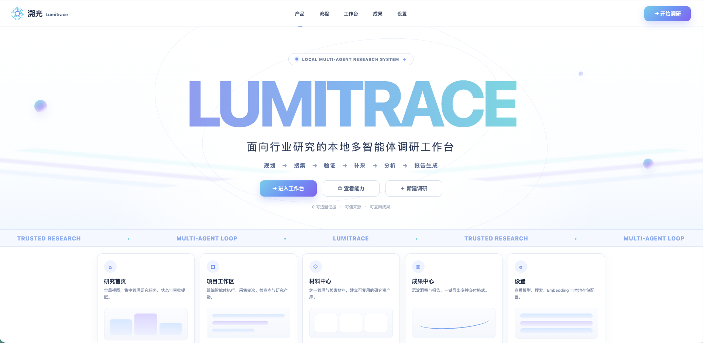

# Research Agent · 通用行业调研 Multi-Agent

**模型无关**的行业调研自动化流水线。支持任何 OpenAI 兼容 API（OpenAI / DeepSeek / Qwen / Ollama / vLLM / 本地模型）。

<p align="center">
  
</p>

## 特点

- **模型无关**：通过 `LLM_BASE_URL` + `LLM_API_KEY` + `LLM_MODEL` 三个环境变量切换任意模型
- **零框架依赖**：不依赖 LangChain / claude-agent-sdk / openai SDK，纯 httpx 自建 LLM 客户端

- **5 个专业 Agent 分工协作**：战略规划 → 数据搜集 → 信息验证 → 深度分析 → 排版交付
- **3 个人机确认检查点**：调研提纲、信息源分层、最终数据源清单——确保方向不跑偏
- **需求澄清对话**：Agent1 判断信息不足时主动提问；CLI 直接在终端问答，Web 在工作台以表单形式回答（可一键全用默认值）
- **Agent2↔3 迭代循环**：采集→验证→反馈→补采，最多 3 轮，数据质量有保障
- **断点续跑**：任何阶段中断（Ctrl+C / 网络错误 / API 异常），状态自动保存，一行命令恢复
- **异常自动重试**：每个阶段失败后自动重试 2 次，友好报错
- **失败可显式重试**：自动重试耗尽或审查未通过后，项目标记为可重试，保留既有产物，在工作台一键重试；不再需要删库重跑
- **执行日志持久化**：每条阶段进展写入项目内 `run_log.jsonl`，服务重启后仍可回溯上次失败前的过程
- **Token 用量可见**：按阶段累计消耗，首页提供统计卡、52 周热力图、阶段分布与项目排行
- **中断自动识别**：服务重启时扫描停在 Agent 执行中的项目，标记为可重试而非静默挂起
- **多搜索源**：DuckDuckGo（免费）/ SerpAPI / Tavily，可在设置页切换并测试连通性
- **信息源 S/A/B/D 四级分层**：默认规则内置，杜绝低质信息
- **统一材料中心**：PDF、Office、HTML、图片和压缩包统一解析、OCR、版本化和项目隔离检索
- **确定性证据链**：Agent 必须保存精确 EvidenceRecord；未解决矛盾、无效定位或无证据会阻断交付
- **真实混合检索**：关键词、同义词和数值归一化默认可用；配置 Embedding API 后启用真实语义向量融合

## 架构

```
用户输入主题
  │
  ▼
Orchestrator（单一状态机 · 11 个阶段 · 3 个检查点 + 需求澄清）
  │
  ├── Agent1 · 战略规划    → 需求澄清问答 → outline.md          ⏸ 用户确认
  ├── Agent2 · 数据搜集    → 源分层清单                        ⏸ 用户确认
  ├── Agent2↔3 · 循环      → 采集-验证（≤3轮）→ 源终稿        ⏸ 用户确认
  ├── Agent4 · 深度分析    → 全方位分析（波特五力/SWOT/...）
  └── Agent5 · 排版交付    → Markdown + 图表清单 + 安全 HTML + 正式 PDF
```

## 环境要求

- **Python >= 3.10**（推荐 3.11+）
- 任何 **OpenAI Chat Completions API 兼容服务**（OpenAI / DeepSeek / Qwen / Ollama / vLLM）
- 正式 PDF 需要 **XeLaTeX**；Pandoc 由 Python 依赖 `pypandoc-binary` 提供，也可使用系统 Pandoc
- 无需 Anthropic API Key

## 安装

```bash
# 推荐用 uv（最快）
cd research-agent
uv venv --python 3.11
source .venv/bin/activate
uv pip install -e .

# 或用 pip
pip install -e .
```

配置模型（编辑 `.env`）：

```bash
cp .env.example .env
# 编辑 .env，设置你的模型服务：

# OpenAI
LLM_BASE_URL=https://api.openai.com/v1
LLM_API_KEY=sk-xxx
LLM_MODEL=gpt-4o

# DeepSeek
# LLM_BASE_URL=https://api.deepseek.com/v1
# LLM_MODEL=deepseek-chat

# 本地 Ollama
# LLM_BASE_URL=http://localhost:11434/v1
# LLM_API_KEY=ollama
# LLM_MODEL=qwen2.5:72b
```

## 使用

### 启动材料中心

```bash
pip install -e '.[web,search]'
SOURCE_DATA_DIR=.data/sources research-agent-web
```

打开 `http://127.0.0.1:8000/materials`，即可上传、查看处理进度、预览、编辑元数据、激活、重处理、比较版本、搜索和归档材料。本地 Web 会后台处理上传任务；生产环境仍建议单独运行：

```bash
research-agent-source-worker --data-dir .data/sources
```

> **访问控制**：工作台默认绑定 `127.0.0.1`，仅本机可访问，无需认证。若要暴露到网络，
> 必须先在 `.env` 设置 `WEB_AUTH_TOKEN`，否则启动会被拒绝——未认证的工作台允许任何
> 访问者读取全部调研数据、修改模型配置（含写入 `.env`）和删除项目。设置令牌后，
> 首次访问带上 `?token=…`（随后写入 cookie），或在请求中携带 `X-Auth-Token` 头。

CLI 使用同一个领域服务：

```bash
research-agent sources --data-dir .data/sources upload PROJECT report.pdf financials.xlsx
research-agent sources --data-dir .data/sources process
research-agent sources --data-dir .data/sources search PROJECT '2025 年营业收入'
research-agent sources --data-dir .data/sources verify PROJECT
research-agent sources --data-dir .data/sources rebuild-index PROJECT
research-agent sources --data-dir .data/sources backup ./backups/2026-07-17
```

### 启动新调研

```bash
python -m research_agent new "新能源汽车行业"
```

系统会：
1. 创建项目目录 `projects/新能源汽车行业_20260424/`
2. Agent1 判断信息是否充分；不足时向你提问澄清（可跳过，用建议默认值）
3. 生成提纲，并同步固化研究需求清单 `research_requirements.json` → 你确认后 → 继续推进后续阶段
4. 全部完成后输出 Markdown、真实图表、安全 HTML、LaTeX 源文件和统一正式 PDF

### 研究需求清单（确定性完整性门禁）

Agent1 生成提纲时，会把提纲《核心研究问题》小节固化成 `research_requirements.json`：

```json
{
  "schema_version": 1,
  "topic": "新能源汽车行业",
  "source_outline": "0a1b2c3d4e5f6789",
  "requirements": [
    {
      "question_id": "q1",
      "text": "2024 年市场规模是多少？",
      "required": true,
      "min_supported": 1,
      "min_source_tier": null,
      "require_numeric": false
    }
  ]
}
```

这份清单是全流程唯一的问题标识来源：

- Agent2/3/4/5 的 prompt 都注入同一张表，`RecordProjectEvidence` 的 `research_question_id` 必须取自其中，表外 ID 会被工具拒绝
- 确定性质量门读取**清单全集**判定覆盖率，而不是从已有证据反推。必答问题一条证据都没有时同样会被检测到并阻断交付
- `source_outline` 绑定生成清单时的提纲摘要；当前 `01_outline.md` 发生变化后，旧清单立即失效，必须重新确认研究范围
- 需要收紧某个问题的通过条件（最低证据数、最低来源等级、是否要求数值），直接编辑该文件即可；改成 `"required": false` 的问题缺证据不会单独阻断交付

提纲缺少可解析的《核心研究问题》有序列表，或者清单缺失、为空、`question_id` 重复、JSON 损坏、与当前提纲摘要不一致时，交付一律阻断，不会用章节标题、通用问题或空要求放行。

**旧项目迁移**：本机制上线前创建的项目没有这个文件。用以下命令从既有提纲重建，或在工作台的「需要重新确认研究计划」面板点击「生成研究需求清单」：

```bash
python -m research_agent migrate-plan projects/新能源汽车行业_20260424
```

迁移只固定问题清单，不补造证据——必答问题仍需要合格证据才能通过交付门禁。
已有且与当前提纲匹配的有效清单不会被迁移命令覆盖，以免丢失人工收紧的证据门槛或重新分配问题 ID。

### 断点续跑

```bash
python -m research_agent resume projects/新能源汽车行业_20260424
```

从上次中断的阶段继续。

### 重试失败的调研

审查未通过（证据质量门槛不达标）或某个 Agent 阶段报错后，项目会被标记为**失败但可重试**，既有产物（提纲、源清单、历史采集轮次、已入库证据）全部保留：

```bash
# 重试失败阶段；审查未通过时自动追加 1 轮采集验证预算
python -m research_agent retry projects/新能源汽车行业_20260424

# 追加更多轮次
python -m research_agent retry projects/新能源汽车行业_20260424 --extra-rounds 2
```

网页工作台在失败时会展示失败阶段、原始错误和证据门槛未通过原因，并提供「重试并继续」按钮；研究首页的项目列表也可直接重试。

重试的复位规则：

| 失败情形 | 重试行为 |
|---|---|
| 采集验证轮次用尽但证据未收敛 | 追加轮次预算（默认 +1 轮），从下一轮继续补采验证 |
| 交付前证据门槛阻断（分析/排版阶段） | 回退到采集验证阶段重新补证据 |
| 缺少研究需求清单 | 重试被拒绝，需先执行 `migrate-plan` 或在工作台生成清单 |
| 其他 Agent 阶段报错 | 原地重跑该阶段 |

轮次预算没有硬上限，避免项目彻底卡死；超过 10 轮后重试提示会附带成本提醒，建议此时改为在材料中心补充权威材料。

### 删除项目

```bash
python -m research_agent delete projects/新能源汽车行业_20260424 -y
```

网页工作台与研究首页的项目列表也提供删除按钮（二次确认；运行中的项目不允许删除）。删除会移除项目目录及其全部产物，不可恢复。

### 查看项目状态

```bash
python -m research_agent status projects/新能源汽车行业_20260424
```

失败项目会额外显示失败阶段、失败原因和重试命令。

## 项目结构

```
research-agent/
├── pyproject.toml
├── .env.example
├── src/research_agent/
│   ├── __main__.py           # CLI 入口（new / resume / retry / delete / status / migrate-plan）
│   ├── config.py             # 全局配置与常量
│   ├── state.py              # 11 阶段状态机 + JSON 持久化 + 失败/重试标记 + 澄清历史
│   ├── research_plan.py      # 研究需求清单：提纲派生、schema 校验、全流程 question_id 契约
│   ├── checkpoints.py        # 3 个人机确认检查点（Rich CLI 渲染与询问）
│   ├── run_log.py            # 按项目持久化执行日志（run_log.jsonl）
│   ├── token_usage.py        # Token 用量采集、按阶段聚合、跨项目汇总
│   ├── orchestrator.py       # 唯一状态机 + PipelineHost 协议 + 异常兜底 + 失败复位
│   └── agents/
│       ├── strategist.py     # Agent1 战略规划（需求澄清 + 提纲）
│       ├── collector.py      # Agent2 数据搜集（源分层 + 按级采集）
│       ├── validator.py      # Agent3 信息验证（交叉验证 + JSON 反馈）
│       ├── analyst.py        # Agent4 深度分析
│       ├── formatter.py      # Agent5 排版交付
│       └── prompts/          # 各 Agent 的 system prompt（.md）
│           ├── strategist.md
│           ├── collector.md
│           ├── collector_round.md
│           ├── validator.md
│           ├── analyst.md
│           └── formatter.md
├── projects/                 # 调研项目数据（每次一个子目录）
│   └── {topic}_{date}/
│       ├── state.json
│       ├── run_log.jsonl
│       ├── token_usage.jsonl
│       ├── 01_outline.md
│       ├── research_requirements.json
│       ├── 02_sources_draft.md
│       ├── 02_sources_final.md
│       ├── 03_raw_data/
│       │   ├── round_1.md
│       │   ├── feedback_round_1.json
│       │   └── ...
│       ├── 03_validation_report.md
│       ├── 04_analysis.md
│       ├── 05_final_report.md
│       ├── 05_chart_manifest.json
│       ├── 05_charts/              # SVG / PDF / PNG 图表
│       ├── 05_final_report.html
│       ├── 05_final_report.tex
│       └── 05_final_report.pdf
└── tests/
    └── test_state_machine.py
```

## 各 Agent 职责

| Agent | 职责 | 工具权限 | 输出 |
|---|---|---|---|
| **Agent1 战略规划** | 澄清目标/范围/交付物（必要时向用户提问）→ 生成提纲 → 固化研究需求清单 | Read, Write, AskUser（Web） | `01_outline.md` + `research_requirements.json` |
| **Agent2 数据搜集** | 信息源识别+S/A/B/D分层 + 按级采集 | Read, Write, WebSearch, WebFetch | `02_sources_draft.md` + `round_N.md` |
| **Agent3 信息验证** | 原文回查、EvidenceRecord、冲突检测、淘汰低质源 | ReadProjectSource, RecordProjectEvidence, Write | `feedback_round_N.json` + `03_validation_report.md` |
| **Agent4 深度分析** | 波特五力/SWOT/PEST + 定量分析 | Read, Write, WebSearch, WebFetch | `04_analysis.md` |
| **Agent5 排版交付** | 加载项目券商排版 Skill，生成结构、图表清单、执行摘要与交付物 | Read, Write | `05_final_report.md` + `05_chart_manifest.json` + HTML/TeX/PDF |

## 信息源分层标准

| 级别 | 定义 | 示例 |
|---|---|---|
| **S** | 一手权威原始数据 | 上市公司年报、统计局、央行、交易所公告 |
| **A** | 头部研究机构 | 艾瑞/IDC/Gartner、头部券商深度研报 |
| **B** | 专业财经媒体 | 36氪、虎嗅、财新、彭博、路透 |
| **D** | UGC/低可信（默认剔除） | 知乎回答、自媒体公众号 |

## 配置项

通过环境变量或 `.env` 文件配置：

| 变量 | 默认值 | 说明 |
|---|---|---|
| `LLM_BASE_URL` | `https://api.openai.com/v1` | 模型服务地址 |
| `LLM_API_KEY` | — | 必填（本地 Ollama 可填任意值） |
| `LLM_MODEL` | `gpt-4o` | 模型名称 |
| `LLM_TIMEOUT` | `120` | 请求超时（秒） |
| `LLM_MAX_RETRIES` | `3` | 失败重试次数 |
| `LLM_TEMPERATURE` | `0.7` | 生成温度 |
| `SEARCH_API_PROVIDER` | `duckduckgo` | 搜索引擎（`duckduckgo` / `serpapi` / `tavily`） |
| `SEARCH_API_KEY` | — | 搜索 API Key（`serpapi` / `tavily` 必填，DuckDuckGo 不需要） |
| `WEB_AUTH_TOKEN` | — | 网页工作台访问令牌。留空时只允许绑定回环地址；绑定 `0.0.0.0` 等公开地址必须设置 |
| `STRATEGIST_MAX_ROUNDS` | `5` | Agent1 CLI 澄清对话轮次上限（Web 侧澄清问答上限固定 9 条） |
| `MAX_COLLECT_ROUNDS` | `3` | Agent2↔3 采集-验证循环上限 |
| `REPORT_FORMATTING_SKILL` | `brokerage-report-formatting` | Agent5 加载的项目内白名单排版 Skill |
| `REPORT_THEME` | `brokerage_research_v1` | 固定券商研报视觉主题 |
| `REPORT_MAX_CHARTS` | `20` | 单份报告图表数量上限 |
| `REPORT_ENABLE_LLM_CHART_FALLBACK` | `true` | 是否允许特殊图表使用受限 Vega-Lite 兜底 |
| `REPORT_PANDOC_BIN` | `pandoc` | Pandoc 命令；未找到时自动使用 Python bundle |
| `REPORT_LATEX_ENGINE` | `xelatex` | 正式 PDF 的 LaTeX 引擎 |
| `REPORT_RENDER_TIMEOUT` | `120` | 单个报告渲染步骤超时（秒） |
| `SOURCE_DATA_DIR` | `.data/sources` | 材料目录、SQLite catalog 和不可变原文件存储 |
| `SOURCE_EMBEDDING_BASE_URL` | — | OpenAI 兼容 Embeddings API 地址；不配置则只使用离线检索 |
| `SOURCE_EMBEDDING_API_KEY` | — | Embeddings API Key |
| `SOURCE_EMBEDDING_MODEL` | — | 真实语义向量模型，例如多语言 embedding 模型 |
| `SOURCE_API_KEYS_JSON` | — | 可选项目 ACL，例如 `{"key-a":["project-a"],"admin":"*"}` |

## License

MIT
