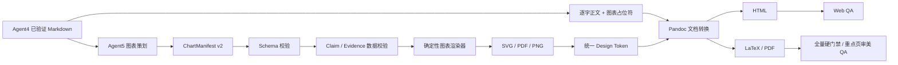

# Agent5 图表与排版视觉系统 v2 改造方案

> 文档状态：待评审
>
> 编写日期：2026-08-18
>
> 适用范围：`Agent5 -> 05_chart_manifest.json -> SVG/PDF/PNG -> HTML/LaTeX/PDF` 交付链路

## 1. 结论与建议

本次不重写 Agent5，也不改造 Agent1—4、状态机、材料中心和 EvidenceRecord 主链路。

保留现有正确架构：

```text
Agent4 已验证分析正文
  -> Agent5 生成声明式图表清单
  -> 程序校验图表数据与证据
  -> 确定性渲染 SVG / PDF / PNG
  -> Pandoc 生成 HTML / LaTeX
  -> 固定 XeLaTeX 模板生成正式 PDF
  -> 全量确定性检查 + 重点页视觉检查
```

改造集中在四个方面：

1. 将 `ChartManifest` 从基础数据清单升级为带视觉语义和证据来源的 v2 契约；
2. 提升确定性图表渲染能力和默认审美，不让 LLM 输出绘图代码；
3. 将 Web、图表和 PDF 的视觉规则统一为同一套 Design Token；
4. 将 PDF QA 拆为全页确定性硬门禁与重点页审美检查，避免把跨平台像素差异当成发布条件。

建议第一阶段先交付最小 `ChartManifest v2`、图表级 Claim 关联、程序反查和来源清理；该门禁通过后，再启用数据标签、重点色、横向柱、目标线、区间图、统一 Theme v2 和宽表格。逐点 Evidence 匹配、复杂图表、非数值信息图和多主题平台放在后续阶段。

## 2. 当前实现基线

### 2.1 当前调用链

Agent5 当前只做图表编辑，不改写 Agent4 正文：

1. `_require_delivery_evidence()` 在调用模型前检查研究需求、QualityGate 和引用完整性；
2. Agent5 读取 `04_analysis.md`，生成 `05_chart_manifest.json`；
3. `_compose_final_report_from_analysis()` 逐字复制 Agent4 Markdown，只插入 `{{chart:<id>}}`；
4. `_audit_composed_report()` 反向确认正文未被改写、删行或重排；
5. `render_chart_manifest()` 使用 Matplotlib 或受限 Vega-Lite 生成图表资产；
6. `build_report_html()` 和 `build_report_latex()` 使用同一份 Markdown 和图表清单；
7. `compile_report_pdf()` 使用 XeLaTeX 编译正式 PDF；
8. `inspect_pdf()` 检查标题、免责声明、文本和抽样预览页。

### 2.2 当前图表能力

现有确定性图表类型：

- `line`
- `bar`
- `stacked_bar`
- `combo`
- `scatter`
- `heatmap`
- `waterfall`

当前 `ChartSpec` 可表达：

- 标题、单位、截止日期、来源、备注；
- 分类标签；
- 多个数值序列；
- 实际值、预测值、估算值；
- 左右轴标记；
- 报告内精确插入锚点；
- 必需或可选图表；
- 特殊图表的受限 Vega-Lite 声明。

### 2.3 当前版式能力

- 固定 A4 中文券商研报模板；
- 深蓝、金色和中性灰固定色板；
- 中文字体候选和 XeLaTeX 字形检查；
- 自动目录、章节编号、页眉页脚和页码；
- Pandoc Markdown 表格；
- Lua 按内容长度分配表格列宽；
- 长 source ID、域名、URL 和长 token 自动增加断点；
- PDF 严重溢出和缺字阻断交付；
- HTML 图表使用 SVG，PDF 图表使用矢量 PDF。

### 2.4 真实成品基线

本轮检查了三份正式报告：

| 报告 | 页数 | 图表数 |
|---|---:|---:|
| MiniMax 未来股价走势 | 25 | 4 |
| SK 海力士股价预测 | 33 | 8 |
| 腾讯股价预测 | 38 | 8 |

20 张实际图表中共有 15 张柱状图、4 张折线图和 1 张柱线组合图。虽然代码支持 7 种确定性图表，但真实使用高度集中在 3 种基础类型。

### 2.5 已确认的视觉与表达问题

1. 图表主要是单色柱图和折线图，结论表达方式重复；
2. 缺少关键值标签、目标线、基准线、区间带、事件节点和文字注释；
3. 长公司名、长业务名仍使用竖向柱图，横轴标签偏小；
4. 情景上下限使用双柱模拟，不如区间图直观；
5. 多类别 SOTP 和机构目标价图信息密度高，但视觉层级不足；
6. 图表来源为自由文本，可能把内部 `[src:...]` 标记直接带入图注；
7. 图表数值没有逐点的确定性 Claim/Evidence 关联；
8. Web、图表和 LaTeX 的颜色、字号、间距分别维护，存在视觉漂移风险；
9. 封面、目录、章节和普通正文的版式变化较少，长报告阅读节奏单一；
10. 宽表格可以避免严重溢出，但仍可能出现单字换行和字号偏小；
11. 长报告 PDF QA 只抽样部分页面，无法发现其他页面的孤行、过度留白和图注问题；
12. 当前 QA 更偏“能否生成”，还不是稳定的视觉质量门禁。

## 3. 改造目标

### 3.1 功能目标

- 保留 Agent4 正文逐字保真；
- 常见研究数据能选择更匹配的图表表达；
- 图表能够表达重点、基准、区间、预测和事件；
- 图表数据可以追溯到有效 Claim 和 SUPPORTED EvidenceRecord；
- Web 和 PDF 使用一致的主题、图表和表格语义；
- 正式 PDF 具备稳定的封面、摘要、章节、图表、表格和风险版式；
- 所有页面都进入确定性质量检查，重点页进入高分辨率视觉检查；
- 旧版 `ChartManifest.version=1` 和旧项目仍可重新排版。

### 3.2 视觉目标

采用“高级、克制、信息优先”的中文券商研报风格：

- 一张图只表达一个主要结论；
- 重点系列使用主色，其他系列降为中性灰；
- 不使用 3D、渐变、拟物阴影、霓虹色和装饰性图形；
- 图表标题结论先行，单位、时间和来源退居次级；
- 关键数字直接标注，但避免为每个点都添加噪声；
- 实际、预测、估算使用稳定且可解释的视觉编码；
- 页面密度适合 A4 打印，同时保证 Web 阅读；
- 封面和摘要页有识别度，正文不过度设计。

### 3.3 质量目标

- 图表不得成为证据旁路；
- 不允许 LLM 生成 Python、JavaScript、SVG、TikZ 或完整 LaTeX；
- 图表清单结构错误、证据缺失、未知图表或未解析占位符必须阻断；
- PDF 严重溢出、字形缺失、图表过小、图注缺失和关键页面异常必须阻断；
- 结构回归应覆盖所有内置图表类型和至少三份 Golden Report；跨平台感知差异首轮只作提示，不作硬门禁。

## 4. 非目标

本次不做：

- 不让 Agent5 搜索或补充新资料；
- 不允许 Agent5 修改 Agent4 的事实和结论；
- 不建设独立报告发布平台；
- 不建设任意拖拽式模板编辑器；
- 不支持用户上传任意可执行绘图代码；
- 不复制具体券商的商标和专有模板；
- 不一次性增加十几种低频图表；
- 不把产业链图、流程图、2×2 矩阵强行塞进数值 `ChartSpec`；
- 不为了“更漂亮”牺牲来源、证据和可复现性。

## 5. 目标架构



模型负责：

- 判断哪条结论需要图；
- 选择允许的图表类型；
- 从已验证正文中组织图表数据；
- 选择锚点、重点系列、注释意图和必要视觉参数。

程序负责：

- 校验 schema、图表数量和安全字段；
- 校验数值的 Claim/Evidence 关联；
- 统一颜色、字体、坐标、标签、图例和导出格式；
- 生成 HTML、LaTeX 和 PDF；
- 检查正文保真、引用、图表、表格和页面质量。

## 6. ChartManifest v2

### 6.1 设计原则

`ChartManifest v2` 继续保持声明式，不包含绘图代码。新增内容只描述“表达意图”和“证据来源”，不描述任意物理坐标。

### 6.2 建议结构

```json
{
  "version": 2,
  "theme": "brokerage_research_v2",
  "charts": [
    {
      "id": "scenario_target_range",
      "type": "range_bar",
      "title": "基准情景目标价中枢为 650 港元",
      "unit": "港元",
      "as_of_date": "2026-08-18",
      "source": "本报告三档情景推导",
      "placement_after": "### 三档情景",
      "labels": ["悲观", "基准", "乐观"],
      "series": [
        {
          "name": "目标价下限",
          "values": [480, 620, 680],
          "value_kind": ["estimate", "estimate", "estimate"],
          "axis": "left"
        },
        {
          "name": "目标价上限",
          "values": [550, 680, 790],
          "value_kind": ["estimate", "estimate", "estimate"],
          "axis": "left"
        }
      ],
      "visual": {
        "orientation": "horizontal",
        "show_values": true,
        "highlight_labels": ["基准"],
        "number_format": "integer",
        "legend_position": "top"
      },
      "reference_lines": [
        {
          "axis": "value",
          "value": 460.2,
          "label": "当前股价"
        }
      ],
      "annotations": [],
      "bands": [],
      "provenance": {
        "claim_ids": ["c_q7_scenario"]
      },
      "note": "区间来自已验证三情景模型",
      "required": true
    }
  ]
}
```

### 6.3 新增字段

#### `visual`

- `orientation`: `vertical` / `horizontal`
- `show_values`: 是否显示关键数据标签
- `highlight_labels`: 需要高亮的分类
- `highlight_series`: 需要高亮的系列
- `number_format`: `auto` / `integer` / `decimal_1` / `percent_1` / `multiple_1`
- `legend_position`: `top` / `right` / `none`
- `sort`: `input` / `ascending` / `descending`
- `zero_baseline`: 是否强制从零开始

#### `reference_lines`

用于当前值、行业均值、目标值、盈亏平衡线和政策阈值。只允许固定数值与纯文本标签。

- `axis` 使用语义轴 `value` / `category`，不使用物理画布轴 `x` / `y`；
- `orientation=horizontal` 时 `value` 由渲染器映射为横轴，参考线画为竖线；
- `orientation=vertical` 时 `value` 由渲染器映射为纵轴，参考线画为横线；
- `category` 只允许绑定现有 label，禁止输入任意像素或画布坐标。

#### `annotations`

用于已发生事件、拐点和异常值。注释必须绑定现有 label 或数值点，禁止任意画布坐标。

#### `bands`

用于预测区间、合理估值区间、监管阈值区间和敏感性区间。

#### `provenance`

- Agent5 只提交候选 `claim_ids`，它们是待核验线索，不是可信证明；
- 每张必需图至少关联一个当前 `04_claims.json` 中真实存在、且仍出现在 Agent4 正文中的 Claim；
- 程序必须从图表数值反向匹配 Claim 文本及其 `supporting_evidence_ids`，不能因 ID 存在就判定通过；
- 权威 `evidence_ids` 和逐点 `point_refs` 由程序解析后写入 `05_chart_provenance.json`，Agent5 不得直接声明；
- 每个非空关键数据点最终至少能关联 Claim 或 `SUPPORTED` EvidenceRecord；
- 关键图表不得只填写自由文本 `source`。

程序生成的审计产物示例：

```json
{
  "version": 1,
  "charts": [
    {
      "chart_id": "scenario_target_range",
      "resolved_claim_ids": ["c_q7_scenario"],
      "resolved_evidence_ids": ["ev_xxx"],
      "point_refs": [
        {
          "label": "基准",
          "series": "目标价下限",
          "value": 620,
          "claim_id": "c_q7_scenario",
          "evidence_ids": ["ev_xxx"],
          "match_rule": "exact_with_unit"
        }
      ]
    }
  ]
}
```

### 6.4 兼容策略

- `load_chart_manifest()` 同时接受 version 1 和 version 2；
- version 1 在内存中补齐默认 `visual` 和空 `provenance`；
- 旧项目允许继续渲染，但重新运行 Agent5 时输出 version 2；
- `_can_reuse_chart_manifest()` 必须继续先做完整 schema 校验；
- version 2 的必需图表缺少候选 Claim 或程序审计未通过时阻断，新旧项目不静默混用规则；
- `05_chart_provenance.json` 只由程序生成，复用 manifest 时必须连同项目 Claim/Evidence 当前状态重新校验，不能盲目复用旧审计结果。

## 7. 图表渲染器 v2

### 7.1 第一批必须完成的视觉能力

所有现有图表统一增加：

1. 关键值标签；
2. 重点系列和重点分类高亮；
3. 中性系列降噪；
4. 实际、预测、估算的统一编码；
5. 目标线、均值线、零轴线；
6. 预测或合理区间带；
7. 事件节点注释；
8. 百分比、货币、倍数和整数格式化；
9. 长标签自动换行或自动切换横向；
10. 类别数量驱动的动态图高；
11. 图例自动合并与隐藏；
12. 打印字号和颜色对比度下限。

### 7.2 首轮计划新增图表类型

| 类型 | 主要用途 | 优先级 | 落地阶段 |
|---|---|---|---|
| `horizontal_bar` | 长公司名、长业务名和多类别排名 | P0 | 阶段 1B |
| `range_bar` | 估值区间、预测区间、情景上下限 | P0 | 阶段 1B |
| `dumbbell` | 当前值与目标值、两期变化、公司差距 | P1 | 阶段 2 |
| `tornado` | 敏感性分析、关键假设影响 | P1 | 阶段 2 |

### 7.3 第二批候选图表

只有第一批稳定后再增加：

- `stacked_area`: 长周期结构变化；
- `indexed_line`: 股价、行业、指数相对表现；
- `bullet`: 当前值、目标值和阈值；
- `bubble`: 增长、估值、利润率三变量对标；
- `slopegraph`: 两期排名或差距变化；
- `small_multiples`: 多业务同口径趋势比较。

### 7.4 不纳入 ChartSpec 的视觉类型

以下内容后续使用独立 `VisualSpec`，不与数值 Chart 混用：

- 产业链价值图；
- 业务流程图；
- 技术演进时间线；
- 2×2 机会风险矩阵；
- 产品或公司关系图；
- 论点—证据关系图。

独立 `VisualSpec` 同样只允许声明式节点和关系，不允许任意脚本。

## 8. Agent5 图表策划规则升级

### 8.1 图表选择顺序

Agent5 必须按研究意图选择：

| 研究意图 | 默认表达 |
|---|---|
| 时间趋势 | `line` |
| 长名称排名 | `horizontal_bar` |
| 普通类别比较 | `bar` |
| 结构变化 | `stacked_bar` / `stacked_area` |
| 规模与增速 | `combo` |
| 当前值与目标值 | `dumbbell` / `bullet` |
| 情景上下限 | `range_bar` |
| 两指标关系 | `scatter` |
| 三指标公司对标 | `bubble` |
| 敏感性 | `heatmap` / `tornado` |
| 增减贡献 | `waterfall` |
| 精确值和长文本 | 表格，不生成图表 |

### 8.2 图表密度

- 每个主要定量章节 1—2 张；
- 单份报告默认 6—12 张，仍受 `REPORT_MAX_CHARTS` 上限控制；
- 同一章节不得连续插入三张表达相同事实的图；
- 图表必须替代认知负担，而不是复制表格；
- 只有一两个数字时优先使用关键指标块，不生成大图；
- 缺少完整、同口径数据时保留表格或文字，不补点、不插值。

### 8.3 图表标题与注释

- 标题必须是结论，不使用“市场规模图”“估值对比图”；
- 标题不重复单位和日期；
- 注释只解释拐点、口径、预测区间和异常值；
- 来源、日期和备注由模板排版，不烘焙进图形主体；
- 禁止把内部 source ID 作为读者可见来源文字。

## 9. 统一 Design Token

### 9.1 当前问题

图表主题、Web CSS 和 LaTeX 样式分别维护。虽然当前颜色接近，但没有共享的字号、间距、表格和强调规则。

### 9.2 目标

扩展 `theme.json` 为统一主题来源：

```json
{
  "name": "brokerage_research_v2",
  "colors": {
    "primary": "#163A5F",
    "accent": "#D59B2D",
    "positive": "#32745A",
    "negative": "#A64B45",
    "forecast": "#8AA1B5",
    "neutral": ["#5A6672", "#8A96A3", "#C4CDD5"],
    "grid": "#DCE3E8",
    "paper": "#FFFFFF",
    "soft_background": "#F5F7F9"
  },
  "typography": {
    "chart_title_pt": 13,
    "axis_pt": 9,
    "label_pt": 9,
    "source_pt": 8,
    "body_pt": 11
  },
  "spacing": {
    "chart_margin_top": 16,
    "chart_margin_bottom": 20,
    "section_gap": 18
  }
}
```

### 9.3 使用方式

- Python 图表渲染器直接读取 Token；
- Web 报告页面使用由 Token 生成的 CSS Variables；
- LaTeX 构建阶段生成一个受控的 `brokerage-theme.tex` 宏文件；
- 模板中不再重复硬编码颜色和主要字号；
- 第一版只提供一个正式主题，不建设主题编辑器。

## 10. Web 与 PDF 版式升级

### 10.1 封面

- 保留克制留白；
- 增加报告类别、副标题、日期、版本和生成方式的视觉层级；
- 如果正文存在已验证评级、目标价、当前价，可通过结构化字段展示；
- 不从正文猜测缺失封面字段。

### 10.2 分析概要

- 将固定“分析概要”章节中的 3—5 条核心结论渲染为摘要卡片；
- 卡片只改变呈现，不改变文字；
- 支持核心判断、数据覆盖和使用框架三类次级信息；
- PDF 使用受控 `tcolorbox` 或等价环境，Web 使用一致的 CSS Component。

### 10.3 章节与正文

- 一级章节使用稳定的章节引导；
- 二、三级标题保持克制，不增加大面积色块；
- 防止章节标题孤立在页尾；
- 优化列表、段落和表格之间的垂直节奏；
- 页眉显示报告主题和当前章节，页脚显示日期与页码。

### 10.4 图表

- 自动生成“图 1、图 2……”编号；
- 图表编号与来源引用编号使用两个独立序列：图表只显示“图 N”，来源继续显示 `[N]`；
- 来源编号必须复用 `citation_source_order()` 与 `build_source_legend_markdown()`，不得新建第二套来源计数器；
- 标题位于图表上方，来源和备注位于下方；
- 图表与图注不得跨页；
- 图表高度根据类别数动态变化；
- HTML 和 PDF 使用同一图表内容与编号顺序；
- SVG 和 PDF 都使用矢量优先路径。

### 10.5 表格

- 数字列右对齐、文本列左对齐；
- 表头、斑马纹和汇总行具有稳定样式；
- 根据列数和文本长度选择 `normal` / `compact` / `landscape`；
- 超过 5—6 列或预估宽度超过正文时优先使用横向页面；
- 长表格允许跨页并重复表头；
- 避免为保持竖版而把中文压成单字换行。

### 10.6 风险与免责声明

- 风险清单使用轻量风险框，而不是普通正文段落；
- 免责声明保持报告最后一节；
- 低置信度提示继续可见；
- 不允许版式程序隐藏证据不足或风险信息。

## 11. 图表数据证据门禁

### 11.1 当前缺口

正文引用和 Claims 已有确定性门禁，但 `ChartSpec.series.values` 主要依靠 Agent5 Prompt 约束，没有逐点 Claim/Evidence 审计。扩大图表能力前必须补齐这条边界。

### 11.2 建议校验

新增 `validate_chart_provenance()`：

1. 加载当前项目 `04_claims.json`，把 Agent5 提交的 `claim_ids` 仅视为候选集合；
2. 校验候选 Claim 存在、仍在 Agent4 正文中，且其 `supporting_evidence_ids` 可在当前项目反查；
3. 由程序读取候选 Claim 文本和对应 EvidenceRecord 的 `claim`、`excerpt`、`normalized_value`、`unit`、`period`；
4. 校验 EvidenceRecord 状态为 `SUPPORTED`，且 `research_question_id` 与 Claim 一致；
5. 由程序对每个非空关键数据点执行规范化数值匹配并生成 `point_refs`，不接受 Agent5 自报映射作为通过依据；
6. 对计算值要求引用 `kind=derivation` 的 Claim，并验证公式、输入和单位；
7. 匹配结果写入 `05_chart_provenance.json`，记录匹配规则和歧义原因；
8. 缺失证据时删除可选图表或阻断必需图表；
9. 图表来源在交付层复用现有来源编号映射，不显示内部 ID。

### 11.3 数值匹配规则与原型

生产门禁上线前先实现独立原型和 fixture，规则固定为：

1. 使用 `Decimal` 解析数字，统一千分位、全半角符号、正负号和中文数量级；
2. 只允许确定性单位缩放，例如元/万元/亿元、股/万股、百分数与小数；币种转换必须有显式 derivation Claim、汇率和公式，禁止自动猜测；
3. 直接事实优先精确匹配 `normalized_value + unit + period`；缺少结构化值时才在 Claim/Excerpt 文本中匹配；
4. 展示值因四舍五入产生的容差仅使用显示精度对应的半单位区间，例如一位小数允许源值落入 `±0.05`，不设置任意百分比宽容阈值；
5. 百分比与百分点严格区分，`0.12`、`12%` 与 `+12pct` 不自动等价；
6. 区间上下限必须来自同一语句或同一结构化 EvidenceRecord，并保留 `lower` / `upper` 端点角色；
7. 派生值必须记录公式、输入 Claim/Evidence 和单位变换；无法复算则失败；
8. 多处候选、口径冲突、币种不明或期间不一致一律标记为歧义并 fail-closed。

原型测试集至少覆盖：千分位、中文数量级、负数、百分比/百分点、不同显示精度、区间端点、币种冲突、期间冲突和派生值。接入正式必需图门禁前，固定 fixture 必须达到：负例误接收为零、无歧义正例全部通过、歧义样本全部 fail-closed。真实三份报告若出现误拒绝，只能补充明确规则和回归样本，不能临时放宽通用容差。

### 11.4 失败策略

- 必需图表数据无法验证：阻断 Agent5；
- 可选图表数据无法验证：复用现有 `_fallback_table()` 降级为数据表，或保留原正文；
- 不允许 Agent5 通过修改 `required=false` 静默隐藏核心图表失败；
- 不允许从裸 URL、模型记忆或未验证原始材料补充图表数据。

## 12. PDF 与视觉 QA v2

### 12.1 全量确定性硬门禁

每份正式 PDF 必须检查：

- PDF 可打开、页数大于零；
- 标题、免责声明和核心章节存在；
- 没有缺失字形；
- 没有超过纸面边界的严重溢出；
- 没有未解析 `{{chart:...}}`；
- 没有内部 `[src:...]` 出现在读者可见图注；
- 图表清单中的必需图表全部进入 PDF；
- 图表和来源说明未被截断；
- 页面不是异常空白或异常低内容；
- 图表、图注和紧随其后的表格没有明显拆分；
- 宽表格使用正确页面方向；
- 所有页面都执行文本、边界、字形、占位符、必需图、图注和空白页检查；
- 沿用 `_OVERFULL_TOLERANCE_PT` 的分级原则：内容完整性和越出纸面阻断，轻微版式偏差记录警告。

全页低分辨率预览可作为 QA 工件生成，但首轮不以逐页像素相似度阻断交付。

### 12.2 重点页审美检查

对封面、目录、摘要、首张图、图表密集页、宽表格页、风险页和末页进行确定性抽样，并输出高分辨率预览。以下项目首轮作为人工验收或软提示：

- 页面节奏、留白和视觉层级；
- 图表与正文的审美协调；
- 数据标签是否显得拥挤；
- 颜色、字号和打印尺度是否舒适。

抽样规则和页码必须写入 `05_pdf_qa.json`，确保同一报告可重复比较。

### 12.3 图表检查

- SVG、PDF、PNG 三种资产存在且尺寸正常；
- 图表标题、轴、标签和图例可读；
- 最小字号符合打印要求；
- 颜色对比度可接受；
- 实际、预测、估算视觉编码一致；
- 长标签没有裁切；
- 数据标签没有大面积重叠；
- 参考线和注释不遮挡主要数据。

### 12.4 视觉回归

建立两类 Golden：

1. 图表级 Golden：每个确定性类型至少一个固定输入和预期快照；
2. 报告级 Golden：短报告、长表格报告、图表密集报告各一份。

首轮视觉回归以确定性结构检查为主：

- 全量检查结构、尺寸、文字提取、资产数量、警告和未解析内容；
- 图表级 Golden 在固定字体和渲染环境中可记录感知差异，但默认只告警；
- 报告级 Golden 只比较重点页并由人工确认，不设置跨平台发布阻断阈值；
- 主题升级时显式更新 Golden，不静默接受变化。

## 13. 分阶段实施计划

### 阶段 0：基线冻结

目标：在修改视觉前固定当前正确行为。

任务：

- 保存三份真实报告的页数、图表数、manifest 和 QA 信息；
- 为 7 个现有图表类型建立固定测试输入；
- 建立短报告、长表格、图表密集三个报告 fixture；
- 记录当前 Web/PDF 截图和渲染日志；
- 先实现数值匹配算法原型和正反例 fixture，覆盖单位、精度、区间、期间、币种与派生值；
- 确认现有 Agent4 正文保真、引用审计和 PDF 生成测试通过。

退出条件：

- 有可重复的基线命令；
- 数值匹配 fixture 中误接收为零、全部确定性正例通过；歧义样本均 fail-closed；
- 后续每个阶段都能对比视觉和功能回归。

### 阶段 1：安全基座与高收益视觉升级

目标：先封住图表证据旁路，再在同一交付阶段改善现有图表和版式。阶段 1A 未通过前不得启用阶段 1B 的新图表类型。

阶段 1A：最小 v2 与图表级门禁

- 实现 v1/v2 联合加载和最小 `provenance.claim_ids`；
- 将 Agent5 提交的 Claim ID 视为候选，由程序反查 Claim 是否存在、是否仍在正文、是否关联当前 `SUPPORTED` EvidenceRecord；
- 使用阶段 0 原型确认每张必需图的直接事实值可在候选 Claim 中找到，不依赖 Agent5 自报 Evidence ID；
- 生成程序拥有的 `05_chart_provenance.json`，首轮记录图表级匹配结果；
- 清理图表来源中的内部引用标记，并复用现有来源编号映射；
- 为缺失 Claim、未知 Claim、数值不匹配和非 SUPPORTED EvidenceRecord 增加阻断测试。

阶段 1B：高收益视觉与版式

- 增加数据标签、重点色、预测编码、参考线和动态图高；
- 新增 `horizontal_bar` 和 `range_bar`；
- 将长标签图自动改为横向表达；
- 升级固定 Theme v2；
- 图表标题、单位、来源和备注形成统一层级；
- 宽表格自动切换 compact 或 landscape；
- 对所有页面执行确定性硬门禁，并输出重点页高分辨率预览。

退出条件：

- 真实三份报告重排成功；
- 每张必需图至少有一个经程序反查确认的真实 Claim，阶段 1B 没有绕过该门禁；
- 现有 20 张图表中适合横向或区间表达的图得到正确升级；
- 没有新增证据、引用、排版或字体错误。

### 阶段 2：逐点 Evidence 审计与扩展图表

目标：把阶段 1 的图表级 Claim 门禁升级为逐点可审计、可复现。

任务：

- 完成 `visual`、annotation、band 等 v2 字段；
- 实现完整 `validate_chart_provenance()`，逐点反查 Claim 与 `SUPPORTED` EvidenceRecord；
- 将权威 `evidence_ids`、`point_refs` 和 `match_rule` 作为程序产物写入审计文件；
- 为派生值验证公式、输入、单位与期间；
- 新增 `dumbbell` 和 `tornado`；
- 更新 Agent5 Prompt、Skill chart rules 和 manifest 示例；
- 为端点角色、单位换算、四舍五入、期间冲突、币种冲突和歧义匹配增加阻断测试。

退出条件：

- 新生成图表均为 version 2；
- 必需图表每个关键点均由程序生成可追溯记录，而非依赖 LLM 承诺；
- 旧项目仍可重新排版；
- Agent5 无法用未验证数据生成正式图表。

### 阶段 3：报告版式系统 v2

目标：形成统一、稳定且更有阅读节奏的 Web/PDF 报告。

任务：

- 统一 Design Token；
- 升级封面和目录；
- 将分析概要渲染为摘要卡片；
- 增加图表和表格编号；
- 优化章节、Callout、风险框和免责声明；
- 保证图表与图注不拆页；
- 完善 Web 与 PDF 的一致性测试；
- 建立报告级视觉回归。

退出条件：

- Web/PDF 主题、编号、颜色和信息层级一致；
- 三份 Golden Report 无严重留白、裁切、缺字和窄表单字换行；
- 全页确定性硬门禁通过，重点页视觉抽查通过。

### 阶段 4：扩展视觉组件（可选）

在前述阶段稳定后，再评估：

- stacked area、indexed line、bubble、bullet、slopegraph、small multiples；
- 独立 `VisualSpec`；
- 产业链、时间线、2×2 矩阵和关系图；
- 多主题选择；
- 主题预览和用户级品牌配置。

该阶段不是本次首要交付条件。

## 14. 文件改动范围

| 文件 | 计划改动 |
|---|---|
| `src/research_agent/report_charts.py` | Manifest v2、语义轴、图表样式、新类型和声明式字段白名单 |
| `src/research_agent/report_formatting.py` | 独立图表编号、统一图注、版式转换、全量硬门禁与重点页抽样 |
| `src/research_agent/agents/formatter.py` | v2 manifest 生成、程序化 provenance 审计、失败策略和审计接入 |
| `src/research_agent/agents/prompts/formatter.md` | 图表选择、视觉参数和候选 Claim 规则；禁止自报权威 point refs |
| `skills/brokerage-report-formatting/SKILL.md` | v2 工作流和输出契约 |
| `skills/brokerage-report-formatting/references/chart-rules.md` | 新图表选择、标签、参考线、区间和注释规则 |
| `skills/brokerage-report-formatting/references/quality-checklist.md` | provenance、全量确定性门禁与重点页视觉检查 |
| `skills/brokerage-report-formatting/assets/theme.json` | 统一 Design Token |
| `skills/brokerage-report-formatting/assets/brokerage-report.tex` | 封面、目录和模板变量 |
| `skills/brokerage-report-formatting/assets/brokerage-report.sty` | 摘要卡片、图表、表格、风险框和版式 |
| `skills/brokerage-report-formatting/assets/brokerage-report-tables.lua` | 表格语义、横向页面和数字列对齐 |
| `src/research_agent/web_static/styles.css` | Web 报告主题和组件样式 |
| `tests/test_report_charts.py` | v2 schema、语义轴、类型、数值匹配、证据和渲染测试 |
| `tests/test_report_formatting.py` | HTML/PDF、宽表、双编号体系和分级 QA 测试 |
| `tests/test_brokerage_report_skill.py` | Skill 资源与引用覆盖测试 |
| `tests/fixtures/brokerage_report/` | v2 manifest 和 Golden fixtures |

第一阶段不需要改动：

- Agent1—4；
- `state.py` 阶段模型；
- Agent2↔3 采集验证循环；
- SourceService 数据模型；
- Web 项目创建流程。

## 15. 测试方案

### 15.1 Schema 与安全测试

- v1/v2 manifest 正常加载；
- 非法类型、重复 ID、长度不一致被拒绝；
- URL、脚本、表达式和未知数据列被拒绝；
- annotation 只能绑定现有点；
- reference line 和 band 使用语义轴且数值合法，物理 `x/y` 轴被拒绝；
- provenance 中未知 Claim 被拒绝；
- 非 SUPPORTED EvidenceRecord 被拒绝；
- Agent5 输入中的 `evidence_ids`、`point_refs` 等权威映射字段被拒绝；
- annotation、reference line、band 继续复用 `_FORBIDDEN_SPEC_KEYS`、`_ALLOWED_MARKS` 的声明式白名单范式，拒绝 URL、表达式、transform 和任意坐标；
- 超过图表数量上限被拒绝。

### 15.2 图表测试

- 所有确定性类型生成 SVG/PDF/PNG；
- 横向柱长标签不裁切；
- range bar 正确表达上下限；
- horizontal/vertical 下的 `axis=value` 分别映射到正确的物理轴；
- 预测值使用统一样式；
- 参考线、区间带和注释存在；
- 图表高度随类别数量变化；
- 数字格式符合单位；
- 缺失必需图表资产阻断交付。

### 15.3 HTML/PDF 测试

- HTML 和 PDF 使用相同图表顺序；
- “图 N”与来源 `[N]` 各自连续且互不影响，HTML/PDF 编号一致；
- 宽表格使用横向或紧凑布局；
- 长 source ID 和 URL 不越界；
- 无缺字和严重 Overfull；
- 无内部 source token 出现在图注；
- Agent4 正文仍然逐字保真；
- 全部页面进入确定性检查；重点页抽样规则、页码和预览路径可复现。

### 15.4 真实报告回归

至少使用以下三类报告：

1. 25 页左右、图表较少的估值报告；
2. 30 页以上、图表和长表格较多的行业/公司报告；
3. 35 页以上、情景和 SOTP 密集的综合报告。

检查：

- 页数是否异常增加；
- 图表是否选择更合理；
- 表格是否可读；
- 标题、图注、来源是否一致；
- 是否有大面积异常空白；
- 图表字体和颜色在打印尺度下是否清晰；
- Web 与 PDF 的结论、图表、编号是否一致。

## 16. 验收标准

### 16.1 功能验收

- Agent5 仍只写图表清单，不改写正文；
- 旧版 manifest 和旧项目可继续渲染；
- 新项目默认生成 version 2 manifest；
- 阶段 1A 完成后，新 v2 必需图表必须先通过图表级 Claim 反查；
- 阶段 1B 完成后，现有 7 种及新增的 `horizontal_bar`、`range_bar` 均能稳定输出三种资产；
- 阶段 2 完成后，所有关键点都有程序回填的 Evidence 审计，`dumbbell` 和 `tornado` 同样通过三种资产与证据门禁测试；
- 图表占位符、必需图表和锚点校验继续 fail-closed；
- HTML、TeX 和 PDF 一次生成且路径保持兼容。

### 16.2 证据验收

- 每张必需图至少关联一个有效 Claim；
- 每个关键非空数据点有 Claim 或 SUPPORTED EvidenceRecord 来源；
- Claim ID 只作为候选线索；正式通过结果来自程序反向数值匹配；
- `point_refs` 与权威 Evidence ID 由程序回填，不能由 Agent5 自证；
- 图表来源不出现裸 URL、内部 source ID 或未验证材料；
- 图表失败不能绕过现有交付门禁；
- Agent4 与 Agent5 的结论、数字和引用不发生漂移。

### 16.3 视觉验收

- 长标签图不裁切；
- 情景区间不再使用误导性的普通双柱表达；
- 关键数据能够直接阅读；
- 重点色使用克制且含义一致；
- 图表、表格和正文层级清晰；
- 宽表格不再出现大面积单字换行；
- 无缺字、重叠、严重溢出和未解析占位符；
- 三份 Golden Report 的全量确定性检查通过，重点页人工检查通过。

### 16.4 工程验收

- 相关测试全部通过；
- `git diff --check` 通过；
- Python 编译检查通过；
- XeLaTeX 和 Pandoc 环境检查通过；
- 每个阶段有独立提交和可回滚边界；
- 不混入无关 Web、材料库或 Agent4 改动。

## 17. 风险与控制

| 风险 | 控制措施 |
|---|---|
| 图表变丰富后引入未验证数据 | 新类型启用前先完成图表级 Claim 反查；逐点 Evidence 审计随后加强 |
| 新类型导致排版不稳定 | 先做 4 个高频类型；所有类型同时输出 SVG/PDF/PNG |
| 主题改动影响旧报告 | v1/v2 主题并存，旧项目默认兼容 |
| CSS、图表和 LaTeX 视觉不一致 | 单一 Design Token 来源 |
| 全页 QA 增加渲染耗时 | 全页只跑确定性硬门禁和可选低分辨率工件；高分辨率仅覆盖重点页 |
| 像素回归跨平台不稳定 | 首轮不设跨平台像素发布门禁；固定环境感知差异只告警，重点页人工确认 |
| LLM 自报 provenance 造成假通过 | Claim ID 仅为候选；Evidence 与 point refs 由程序反查并回填 |
| 数值匹配误杀或放过口径差异 | Decimal、单位/期间/端点规则、正反例 fixture、歧义 fail-closed |
| 宽表格横向页面破坏阅读连续性 | 仅超过阈值时启用，保留表头和页码 |
| LLM 滥用复杂图表 | Skill 映射规则、schema 限制和最大数量 |
| 旧 manifest 无 provenance | 旧项目兼容读取；只有新 v2 图表强制门禁 |

## 18. 回滚方案

保留：

- `brokerage_research_v1` 主题；
- version 1 manifest loader；
- 原 7 种确定性图表渲染路径；
- 当前 LaTeX 模板和样式资产；
- `REPORT_THEME` 环境变量选择。

建议加入独立开关：

```text
REPORT_VISUAL_V2_ENABLED=false
```

关闭时：

- Agent5 继续生成或兼容使用 version 1 manifest；
- 使用 `brokerage_research_v1`；
- 不启用新布局 Filter 和重点页审美提示；
- 仍保留现有引用、正文保真和 PDF 安全门禁。

## 19. 推荐首轮开发范围

为了控制改造规模，第一轮只交付：

1. 数值匹配原型与正反例 fixture；
2. 最小 ChartManifest v2、v1/v2 联合加载和图表级 Claim 反查；
3. 程序生成的 `05_chart_provenance.json` 图表级审计结果；
4. 图表来源清理并复用现有来源编号；
5. `horizontal_bar` 与 `range_bar`；
6. 数据标签、重点色、预测编码、语义参考线和动态高度；
7. Theme v2 与宽表格 landscape；
8. 全页确定性 PDF 检查、重点页预览与三份真实报告重排对比；
9. 所有现有 Agent5、证据和正文保真测试继续通过。

首轮明确不做：

- 独立 `VisualSpec`；
- 多主题编辑器；
- 用户上传模板；
- Sankey、关系图和复杂信息图；
- LLM 自报权威 `evidence_ids` 或 `point_refs`；
- 跨平台像素级发布门禁；
- 对 Agent4 输出格式做结构性重写。

首轮严格按“安全基座先于视觉能力”的顺序交付：只有第 1—4 项通过，才启用第 5—8 项。完成后用真实报告评估证据误拒绝、视觉提升、页数变化、渲染耗时和错误率，再决定是否进入逐点 Evidence 审计阶段。
